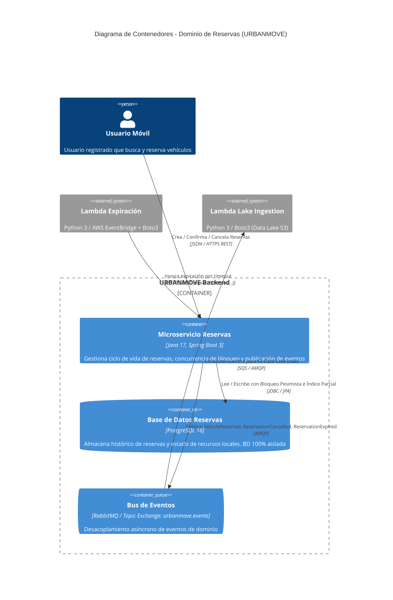

# Diagrama C4 (Contenedores) - Microservicio de Reservas

```mermaid
C4Container
    title Diagrama de Contenedores - Dominio de Reservas (URBANMOVE)

    Person(user, "Usuario Móvil", "Usuario registrado que busca y reserva vehículos")
    System_Ext(lambda_expiry, "Lambda Expiración", "Python 3 / AWS EventBridge + Boto3")
    System_Ext(lambda_ingest, "Lambda Lake Ingestion", "Python 3 / Boto3 (Data Lake S3)")

    Container_Boundary(c1, "URBANMOVE Backend") {
        Container(reservations_svc, "Microservicio Reservas", "Java 17, Spring Boot 3", "Gestiona ciclo de vida de reservas, concurrencia de bloqueo y publicación de eventos")
        ContainerDb(reservations_db, "Base de Datos Reservas", "PostgreSQL 16", "Almacena histórico de reservas y estado de recursos locales. BD 100% aislada")
        ContainerQueue(event_bus, "Bus de Eventos", "RabbitMQ / Topic Exchange: urbanmove.events", "Desacoplamiento asíncrono de eventos de dominio")
    }

    Rel(user, reservations_svc, "Crea / Confirma / Cancela Reservas", "JSON / HTTPS REST")
    Rel(reservations_svc, reservations_db, "Lee / Escribe con Bloqueo Pesimista e Índice Parcial", "JDBC / JPA")
    Rel(reservations_svc, event_bus, "Publica: VehicleReserved, ReservationCancelled, ReservationExpired", "AMQP")
    Rel(lambda_expiry, reservations_svc, "Invoca expiración por timeout", "HTTPS REST (/api/v1/internal/...)")
    Rel(event_bus, lambda_ingest, "Consume eventos para S3 Data Lake (raw)", "SQS / AMQP")
```
